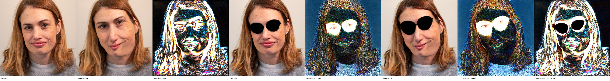
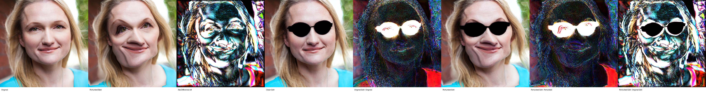
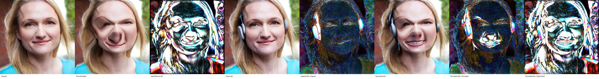
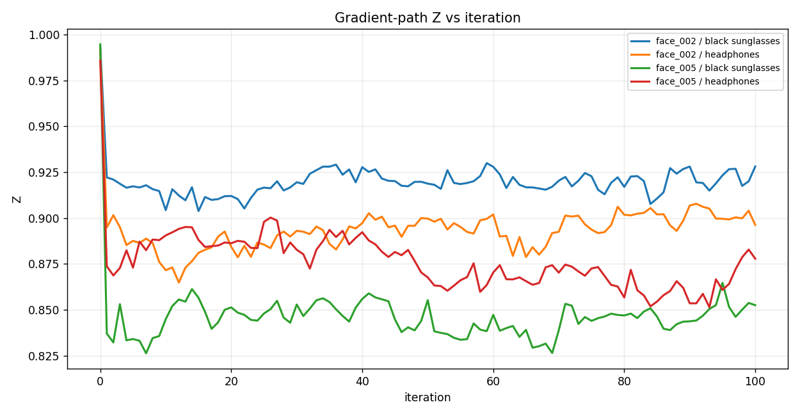
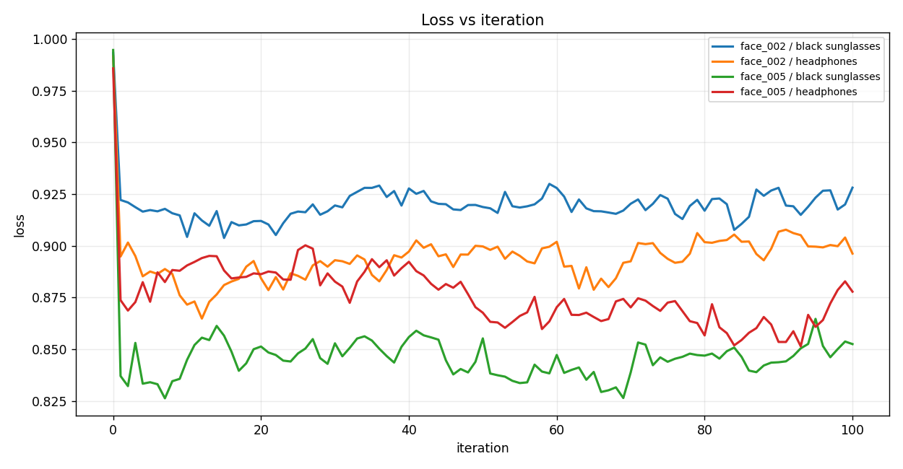
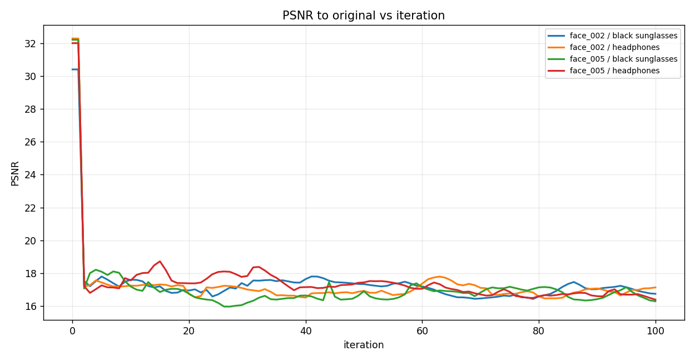
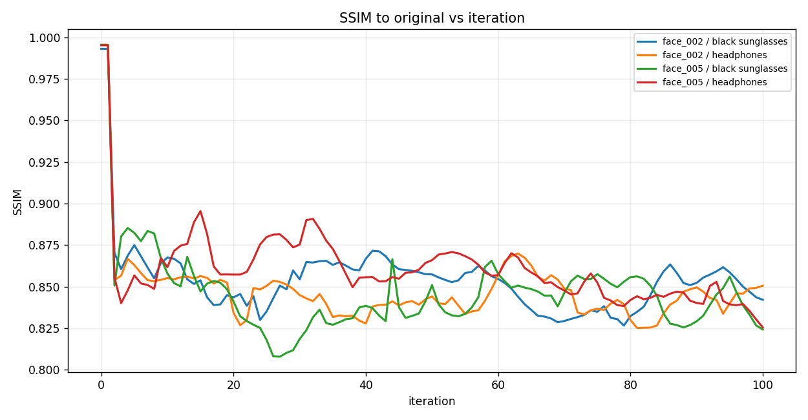
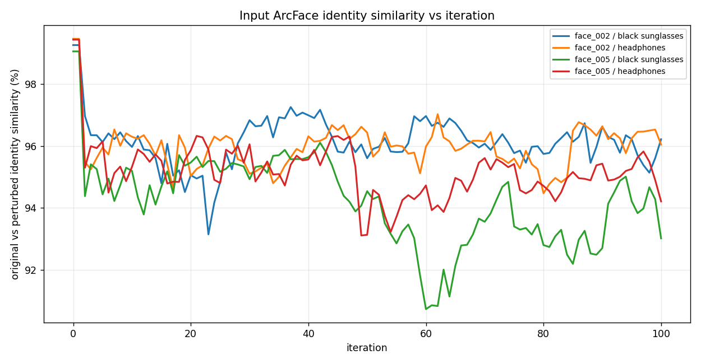
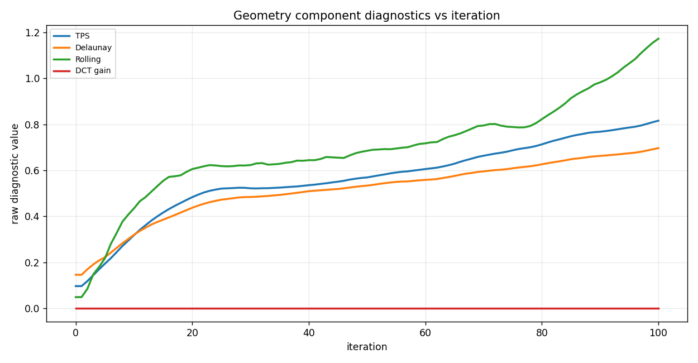

# FACE3: Edited-output ArcFace White-box Optimization

Differentiable InstructPix2Pix edit identity results with geometric perturbations

FACE3 optimizes `Z = cosine_similarity(ArcFace(original_edit), ArcFace(perturbed_edit))` with `loss = Z`. DCT is reported as an image-frequency coefficient perturbation, not a spatial flow.

The Z iteration graph is the differentiable gradient-path Z. Public edited images and stock-public Z values are regenerated at the end with the normal InstructPix2Pix pipeline, so gradient-path Z and stock-public Z are reported separately.

## Image strips

### face_002 / add black sunglasses

### face_002 / add headphones

### face_005 / add black sunglasses

### face_005 / add headphones

## Graphs

### Gradient-path Z vs iteration

### Loss vs iteration

### PSNR to original vs iteration

### SSIM to original vs iteration

### Input ArcFace identity similarity vs iteration

### Geometry component diagnostics vs iteration

